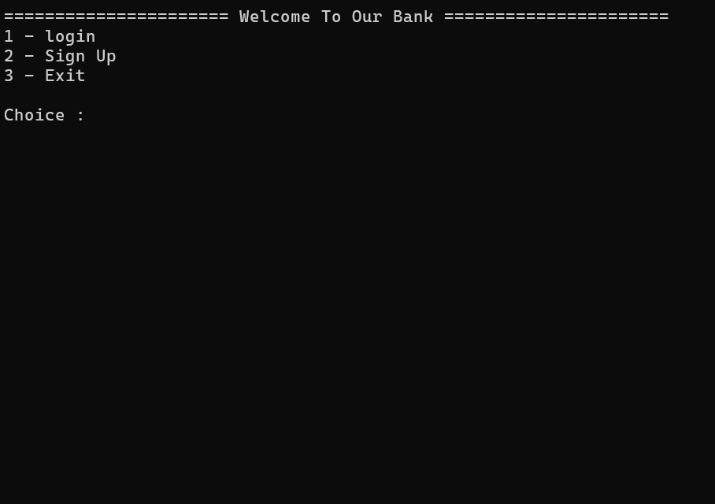
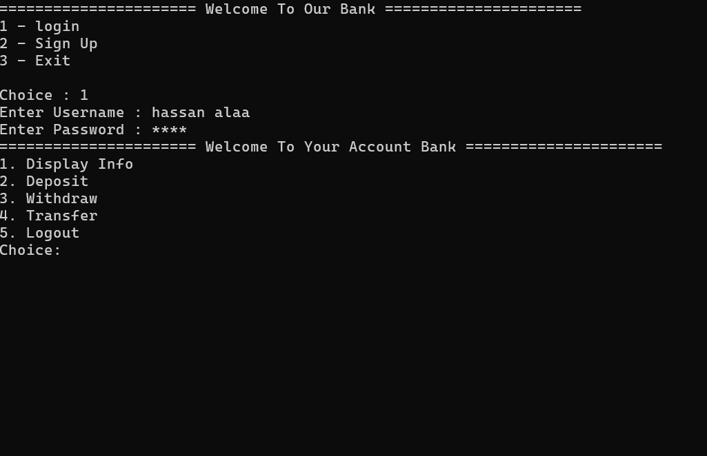
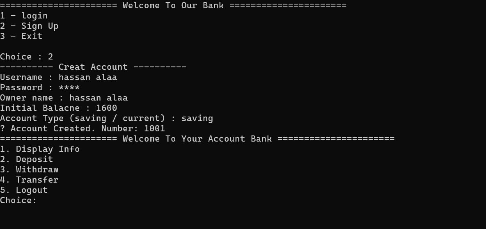

# Bank-System-OOP

- A consol-based Bank Management system written with C++ with object oriented programming.

> It allows to user to login if the user already have an account or Signup
> It allows you to deposit , withdraw , and transfer money from account to anthor , and display info from your accont , and manage their account securely.

## Features : 

1. Create a new account.
2. Secure login with password masked.
3. Deposite and withdraw.
4. Transfer money from acconut to another account.
5. Save and load data from files.
6. Built with core OOP concepts : Polymorphism , Abstraction , Inheritance.

## Tools : 
1. C++.
2. File I/O.
3. OOP (CLasses , Inheritance , Polymorphism , Abstraction).

## Screenshots

**Main Menu:**  

**Login and Dashboard:**  

**Account Creation:**  
